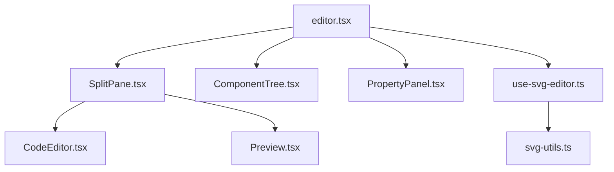

# 架構文檔

## 目錄結構
```
client/src/
├── components/
│   └── svg-editor/
│       ├── CodeEditor.tsx     # SVG代碼編輯器
│       ├── ComponentTree.tsx  # 元件階層導航
│       ├── Preview.tsx        # SVG即時預覽
│       ├── PropertyPanel.tsx  # 屬性編輯面板
│       └── SplitPane.tsx      # 分割視圖布局
├── hooks/
│   └── use-svg-editor.ts      # SVG編輯邏輯
├── lib/
│   └── svg-utils.ts           # SVG處理工具
└── pages/
    └── editor.tsx             # 主編輯器頁面
```

## 核心組件關係


## 數據流
1. SVG解析流程：
   - 原始SVG代碼輸入
   - svg-utils.ts 解析為組件樹
   - ComponentTree 顯示階層結構
   - Preview 渲染可視化效果

2. 元件編輯流程：
   - 用戶在 ComponentTree 選擇元件
   - PropertyPanel 顯示屬性
   - 屬性修改通過 use-svg-editor 處理
   - svg-utils.ts 更新SVG代碼
   - 全局重新渲染

## 主要狀態管理
```typescript
interface EditorState {
  svgCode: string;              // SVG原始代碼
  components: FlatComponent[];  // 扁平化的組件列表
  selectedComponentId: string;  // 當前選中的組件
  hoveredComponentId: string;   // 當前懸停的組件
}
```

## 關鍵實現細節

### 1. SVG解析
- 使用 DOMParser 解析SVG
- 遞歸處理元素樹
- 生成唯一ID和屬性映射

### 2. 組件樹導航
- 建立層級結構
- 處理展開/收起
- 提供元素預覽信息

### 3. 屬性編輯
- 通用屬性處理
- 樣式屬性特殊處理
- 實時更新預覽

### 4. 錯誤處理
- SVG語法驗證
- 元素查找錯誤處理
- 屬性更新錯誤處理

## 擴展點
1. SVG解析器
   - 支持更多SVG特性
   - 優化性能
   - 增強錯誤處理

2. 屬性編輯器
   - 添加更多屬性類型
   - 支持複雜屬性編輯
   - 提供預設值

3. 預覽功能
   - 添加網格和輔助線
   - 支持縮放和平移
   - 增加動畫預覽

4. 元件樹
   - 改進搜索功能
   - 增強過濾功能
   - 添加拖拽支持