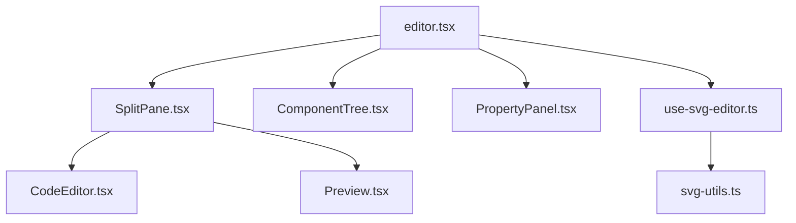

# 架構文檔

## 目錄結構
```
client/src/
├── components/
│   └── svg-editor/
│       ├── CodeEditor.tsx     # 程式碼編輯器組件
│       ├── ComponentTree.tsx  # 組件樹導航組件
│       ├── Preview.tsx        # SVG 預覽組件
│       ├── PropertyPanel.tsx  # 屬性面板組件
│       └── SplitPane.tsx      # 分割視圖組件
├── hooks/
│   └── use-svg-editor.ts      # SVG 編輯器邏輯鉤子
├── lib/
│   └── svg-utils.ts           # SVG 解析工具
└── pages/
    └── editor.tsx             # 主編輯器頁面
```

## 核心組件關係


## 數據流
1. `use-svg-editor.ts` 管理全局狀態
2. SVG 程式碼更改通過 `CodeEditor` 觸發
3. 組件選擇通過 `ComponentTree` 觸發
4. 屬性修改通過 `PropertyPanel` 觸發
5. 預覽通過 `Preview` 組件更新

## 主要狀態管理
- `code`: SVG 程式碼字符串
- `components`: 解析後的組件數組
- `selectedComponent`: 當前選中的組件
- `hoveredComponent`: 當前懸停的組件
- `showGrid`: 網格顯示狀態
- `validationError`: SVG 語法驗證錯誤

## 擴展點
1. SVG 解析器（`svg-utils.ts`）
2. 屬性編輯器（`PropertyPanel.tsx`）
3. 預覽渲染器（`Preview.tsx`）
4. 程式碼編輯器配置（`CodeEditor.tsx`）
